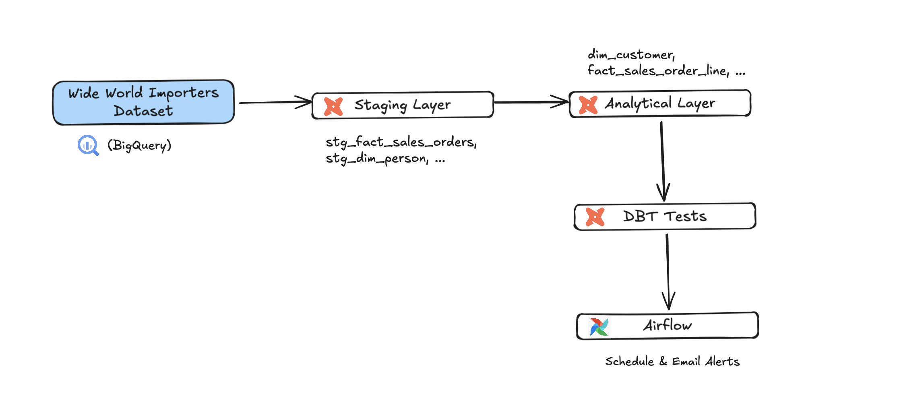

## 🎯 1. Project Overview

- **Dataset**: Wide World Importers (focusing on sales, orders, products, persons, and regions).
- **Tools**: DBT (Data Build Tool), Airflow, BigQuery.
- **Objectives**:
    - Build staging and analytical models.
    - Ensure data quality through comprehensive tests (not null, unique, foreign key, accepted values, etc.).
    - Automate the pipeline with Airflow and enable email alerts for errors.
    - Handle NULL values intelligently (distinguishing between NULLs from source data and NULLs due to missing data).
## 2. Architecture

- **Source Data**: Wide World Importers dataset in BigQuery.
- **Staging Layer**: Staging tables (stg_fact_sales_orders, stg_dim_person, etc.).
- **Analytical Layer**: Dimension and fact tables (dim_customer, fact_sales_order_line, etc.).
- **Testing Layer**: DBT tests for data quality.
- **Scheduling & Monitoring**: Airflow DAGs for scheduling and email alerts



| **Component** | **Description** | **Tool** |
| --- | --- | --- |
| Source Data | Wide World Importers dataset in BigQuery | BigQuery |
| Staging Layer | Standardizes raw data, casts data types, adds default values | DBT |
| Analytical Layer | Builds dimension and fact tables, joins data, computes metrics | DBT |
| Testing Layer | Ensures data quality: not null, unique, foreign key, accepted values, etc. | DBT |
| Scheduling | Schedules DBT jobs and sends email notifications on failure | Airflow |

## 3. Dataset Introduction: Wide World Importers

### **About the Dataset**

The Wide World Importers dataset is a sample database created by Microsoft to simulate a wholesale company's operations. It contains data related to sales, purchasing, inventory, and more, making it an ideal dataset for practicing data modeling and analytics. For this project, I focus on the following domains:

- **Sales & Orders**: Customer transactions, order details, and related entities.
- **Products**: Product details, suppliers, and packaging types.
- **Persons**: Employees, salespeople, and contacts.
- **Regions**: Cities and state/provinces for customer delivery and postal addresses.

The dataset is stored in BigQuery under the schema `trangdang.dbt_project`.

For more detail, can refer to this doc: https://dataedo.com/samples/html/WideWorldImporters/doc/WideWorldImporters_5/home.html

### **Schema of Key Tables Used**

Below are the schemas of the main tables I used in this project, extracted from the`Wide World Importers` dataset:

| **Table** | **Description** | **Key Columns** |
| --- | --- | --- |
| `sales__orders`  | Stores sales order headers | `order_id`, `customer_id`, `salesperson_person_id`, `order_date`, `expected_delivery_date`, `is_undersupply_backordered`  |
| `sales__order_lines`  | Stores line items of sales orders | `order_line_id`, `order_id`, `stock_item_id`, `package_type_id`, `quantity`, `unit_price`  |
| `sales__customers` | Stores customer information | `customer_id`, `customer_name`, `buying_group_id`, `customer_category_id`, `delivery_city_id`, `primary_contact_person_id`  |
| `sales__customer_categories` | Stores customer category details | `customer_category_id`, `customer_category_name`  |
| `sales__buying_groups` | Stores buying group details | `buying_group_id`, `buying_group_name`  |
| `purchasing__suppliers` | Stores supplier information | `supplier_id`, `supplier_name`, `supplier_category_id`  |
| `purchasing__supplier_categories` | Stores supplier category details | `supplier_category_id`, `supplier_category_name` |
| `application__people` | Stores person details (employees, contacts) | `person_id`, `full_name`, `search_name`, `is_employee`, `is_salesperson` |
| `application__state_provinces`  | Stores state/province details | `state_province_id`, `state_province_name`  |
| `warehouse__package_types` | Stores package type details | `package_type_id`, `package_type_name` |


## 🧪4. Project Workflow

Outline of unit tests, integration tests, and testing approaches to ensure reliability.

### **4.1. Project Structure**

- **/staging**: Staging tables (`stg_fact_sales_orders`, `stg_dim_person`, etc.).
- **/analytics**: Dimension and fact tables (`dim_customer`, `fact_sales_order_line`, etc.).
- **/tests**: Data quality tests.
- **/dags**: Airflow DAGs for scheduling.

**Directory Structure**

```
/dbt_project
  /staging
    - stg_fact_sales_orders.sql
    - stg_dim_person.sql
    - stg_dim_customer_category.sql
    - ...
  /analytics
    - dim_customer.sql
    - dim_product.sql
    - fact_sales_order_line.sql
    - ...
  /tests
    - dim_customer.yml
    - dim_product.yml
    - ...
  /dags
    - dbt_test.py
```

### 4.2. Building Staging Tables

I started by creating staging tables to standardize raw data. Here’s an example for `stg_fact_sales_orders`:

Example: 

```sql

-- staging/stg_fact_sales_orders.sql
SELECT
  CAST(order_id AS INT) sales_order_key,
  CAST(customer_id AS INT) customer_key,
  CAST(salesperson_person_id AS INT) sales_person_person_key,
  CAST(order_date AS DATE) order_date,
  CAST(expected_delivery_date AS DATE) expected_delivery_date,
  CAST(is_undersupply_backordered AS BOOLEAN) is_undersupply_backordered
FROM trangdang.dbt_project.sales__orders
```

**Table of Staging Tables Created:**

| **Table** | **Description** | **Source Table** |
| --- | --- | --- |
| `stg_fact_sales_orders` | Standardizes sales order data | `sales__orders`  |
| `stg_dim_person` | Standardizes person data | `application__people`  |
| `stg_dim_customer_category` | Standardizes customer categories | `sales__customer_categories` |
| `stg_dim_buying_group` | Standardizes buying groups (adds "Undefined") | `sales__buying_groups` |

### **4.3. Building Analytical Models (Dimension & Fact)**

### **4.3.1. Dependency Graph**

I ensured models run in the correct order based on dependencies. Here’s the dependency graph


**4.3.2. Example Dimension Table: `dim_customer`** 

**Code Example:**

```sql
*- analytics/dim_customer.sql*
WITH dim_customer__source AS(
SELECT  
    CAST (customer_id AS INT ) customer_key
  , CAST (customer_name AS STRING ) customer_name
  , CAST (is_statement_sent AS BOOLEAN ) is_statement_sent
  , CAST (is_on_credit_hold AS BOOLEAN ) is_on_credit_hold
  , CAST (credit_limit AS NUMERIC ) credit_limit
  , CAST (standard_discount_percentage AS NUMERIC ) standard_discount_percentage
  , CAST (payment_days AS INT ) payment_days
  , CAST (account_opened_date AS TIMESTAMP ) account_opened_date
  , CAST (customer_category_id AS INT ) customer_category_key
  , CAST (delivery_city_id AS INT ) delivery_city_key
  , CAST (postal_city_id AS INT ) postal_city_key
  , CAST (COALESCE(buying_group_id,0) AS INT ) buying_group_key
  , CAST (primary_contact_person_id AS INT ) primary_contact_person_key
  , CAST (COALESCE(alternate_contact_person_id,0) AS INT ) alternate_contact_person_key

FROM `trangdang.dbt_project.sales__customers` )

SELECT 
  dc.customer_key
  , dc.customer_name
  , CASE 
      WHEN dc.is_statement_sent IS TRUE THEN "Sent"
      WHEN dc.is_statement_sent IS FALSE THEN "Not Sent"
      ELSE "Invalid" END is_statement_sent
  , CASE 
      WHEN dc.is_on_credit_hold IS TRUE THEN "On Credit Hold"
      WHEN dc.is_on_credit_hold IS FALSE THEN "Not On Credit Hold"
      ELSE "Invalid" END is_on_credit_hold
  , dc.credit_limit
  , dc.standard_discount_percentage
  , dc.payment_days
  , dc.account_opened_date
  , dc.customer_category_key
  , dcat.customer_category_name
  , dc.buying_group_key
  , db.buying_group_name
  , dc.delivery_city_key
  , dim_deli.city_name delivery_city_name
  , dim_deli.state_province_key delivery_state_province_key
  , dim_deli.state_province_name delivery_state_province_name
  , dc.postal_city_key
  , dim_pst.city_name postal_city_name
  , dim_pst.state_province_key postal_state_province_key
  , dim_pst.state_province_name postal_state_province_name
  , dc.primary_contact_person_key
  , dper.full_name primary_contact_full_name
  , dc.alternate_contact_person_key
  , dpa.full_name alternate_contact_full_name

FROM dim_customer__source dc
LEFT JOIN {{ref('stg_dim_customer_category')}} dcat 
...
LEFT JOIN {{ref('dim_person')}} dpa
ON dc.alternate_contact_person_key = dpa.person_key

```

### 4.3.3. Example Fact Table: `fact_sales_order_line`

```sql
-- analytics/fact_sales_order_line.sql

WITH fact_sales_order_line__source AS (
SELECT 
  CAST(order_line_id AS INT) sales_order_line_key
  , CAST(order_id AS INT) sales_order_key
  , CAST(stock_item_id AS INT) product_key
  , CAST(package_type_id AS INT) package_type_key
  , CAST(quantity AS INT) quantity
  , CAST(unit_price AS NUMERIC) unit_price
  , CAST(unit_price * quantity AS NUMERIC)  gross_amount
 FROM trangdang.dbt_project.sales__order_lines
)
 SELECT 
  sales_order_line_key
  , fol.sales_order_key
  , fso.customer_key
  , fso.sales_person_person_key
  , FARM_FINGERPRINT(CONCAT(is_undersupply_backordered,",",package_type_key )) sales_order_line_indicator_key
  , fso.contact_person_key
  , product_key
  , quantity
  , unit_price
  , gross_amount
  , order_date
  , expected_delivery_date
FROM fact_sales_order_line__source fol
LEFT JOIN {{ref('stg_fact_sales_orders')}} fso 
ON  fol. sales_order_key = fso. sales_order_key
```

**Table of Analytical Models:**

| Table | Type | Description | Dependencies |
| --- | --- | --- | --- |
| **dim_customer** | Dimension | Customer info (with buying group / contact persons / locations) | stg_dim_customer_category, stg_dim_buying_group, dim_city, dim_person |
| **dim_product** | Dimension | Product info (includes brand / supplier details) | dim_supplier |
| **dim_supplier** | Dimension | Supplier info with category details | stg_dim_supplier_category |
| **dim_person** | Dimension | Person info (employees / salespeople / contacts) | - |
| **dim_package_type** | Dimension | Types of packages including 'Undefined' & 'Invalid' | - |
| **dim_sales_order_line_indicator** | Dimension | Indicators based on backorder status & package type | dim_package_type |
| **dim_date** | Dimension | Date dimension with calendar breakdown | - |
| **dim_state_province** | Dimension | State/Province details | - |
| **fact_sales_order_line** | Fact | Order line details with customer/product/person info | stg_fact_sales_orders, dim_customer, dim_product, dim_person, dim_package_type, dim_date |
| **stg_fact_sales_orders** | Staging | Sales order base table | trangdang.dbt_project.sales__orders |
| **stg_dim_supplier_category** | Staging | Supplier category lookup | trangdang.dbt_project.purchasing__supplier_categories |
| **stg_dim_customer_category** | Staging | Customer category lookup | trangdang.dbt_project.sales__customer_categories |
| **stg_dim_buying_group** | Staging | Buying group info (with fallback) | trangdang.dbt_project.sales__buying_groups |

### **4.4. Data Quality Testing**

I implemented comprehensive tests to ensure data quality. Here’s an example for `dim_customer`:

```yaml
version 2: 

models:
  - name: dim_customer
    columns: 
    - name: customer_key
      data_tests: 
        - unique 
        - not_null

    - name: customer_name
      data_tests: 
        - not_null

    - name: is_statement_sent
      data_tests: 
        - not_null
        - accepted_values: 
            values: ['Sent', 'Not Sent', 'Invalid']

    - name: is_on_credit_hold
      data_tests: 
        - not_null
        - accepted_values: 
            values: ['On Credit Hold', 'Not On Credit Hold']
     ....

    - name: delivery_state_province_key
      data_tests: 
        - not_null

    - name: primary_contact_person_key
      data_tests: 
        - not_null

    - name: primary_contact_full_name
      data_tests: 
        - not_null

    - name: alternate_contact_person_key
      data_tests: 
        - not_null

    - name: alternate_contact_full_name
      data_tests: 
        - not_null
 
```

**Table of Test Types Applied:**

| **Test Type** | **Example** | **Purpose** |
| --- | --- | --- |
| not_null | `customer_key` in dim_customer | Ensures no NULL values |
| unique | `sales_order_line_key` in fact_sales_order_line | Ensures no duplicates |
| relationships | `customer_key` joins with `dim_customer` | Validates foreign key integrity |
| accepted_values | `is_statement_sent` ("Sent", "Not Sent") | Ensures valid values |
| accepted_range | `order_date` from 2013 to current | Ensures dates are in valid range |
| expression_is_true | `gross_amount = unit_price * quantity`  | Validates computed fields |
| equal_rowcount | Compare `row counts` between fact and source | Ensures no data loss |
| custom_test_equal_sum | Compare `quantity` sum between fact and source | Ensures aggregated values match |

### **4.5. Handling NULL Values**

I distinguished between two types of NULLs and handled them as follows:

- **NULL from Source Data**: For example, `buying_group_id` in `sales__customers` can be NULL. I used `COALESCE(buying_group_id, 0)` and joined with `stg_dim_buying_group` (which includes a default "Undefined" for key 0).
- **NULL from Missing Data**: If `primary_contact_person_key` doesn’t join with `dim_person`, I kept it NULL and added a not_null test to catch the issue.

### **4.6. Scheduling & Monitoring with Airflow**

I used Airflow to schedule the pipeline and send email alerts on failure.

**DAG Example:**

```yaml
# dags/dbt_test.py
from airflow import DAG
from airflow.operators.bash import BashOperator
from datetime import datetime

with DAG(
    dag_id="dbt_test",
    start_date=datetime(2025, 4, 4),
    schedule_interval="@daily",
    default_args={
        "email_on_failure": True,
        "email": "trangdangngoc070@gmail.com"
    }
) as dag:
    dbt_test_dim_person = BashOperator(
        task_id="dim_person",
        bash_command="cd /var/tmp && dbt deps && dbt test --select dim_person"
    )
    ... 
    dbt_test_fact_sales = BashOperator(
        task_id="fact_sales_order_line",
        bash_command="cd /var/tmp && dbt deps && dbt test --select fact_sales_order_line"
    )
    dbt_test_dim_person >> ... >> dbt_test_fact_sales
```


